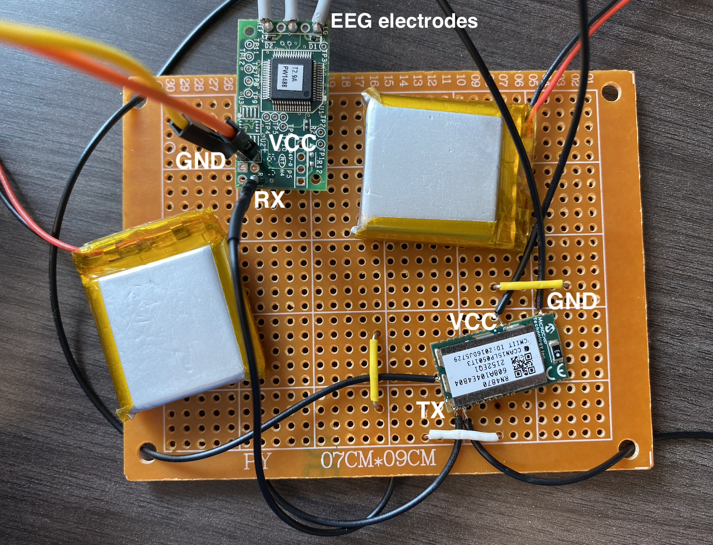
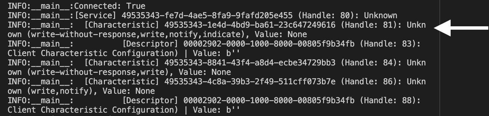

# Simple EEG Project
This project uses the TGAM chip from NeuroSky and the RN4870 chip from Microchip Technology to collect and process real time EEG data wirelessly with Bluetooth LE.

## Hardware
* [TGAM chip](https://store.neurosky.com/products/eeg-tgam)
* [RN4870 chip](https://www.microchip.com/en-us/product/rn4870)
* [USB to Serial Adapter](https://www.amazon.com/HiLetgo-CP2102-Converter-Adapter-Downloader/dp/B00LODGRV8/ref=asc_df_B00LODGRV8/?tag=hyprod-20&linkCode=df0&hvadid=563602091749&hvpos=&hvnetw=g&hvrand=18143711129221568371&hvpone=&hvptwo=&hvqmt=&hvdev=c&hvdvcmdl=&hvlocint=&hvlocphy=9001847&hvtargid=pla-576277438732&psc=1)
* Computer with Bluetooth LE support
* wires and 3.3V power supply

## Software
* Python
* [Bleak](https://github.com/hbldh/bleak)
* [Matplotlib](https://matplotlib.org/)

**_NOTE:_**  Documentations involved in this project is available in the documentation folder.

---
## Overview of the experiment
TGAM chip can support three electrodes (EG,GND,REF), with can record EEG data from one point. The chip outputs the data through UART in the form of data packets. 
The output is transfered to RN4870, which converts it to Bluetooth LE signal. 
Finally, your computer can run the program in "get_notification.py" file to get the data and parse the packets into the form of csv files in "parse" folder.

---
## Setup the experiment

### Setup TGAM
- For the TGAM chip, wire it to power and make sure it’s running at baud rate of 57600 (factory default is 57600) and producing valid data packet. To check the output, we recommend using a USB to Serial adapter like the one mentioned above to connect to your computer and use a Serial terminal software like Coolterm to read the data. For details, please refer to the [TGAM data sheet](http://wearcam.org/ece516/neurosky_eeg_brainwave_chip_and_board_tgam1.pdf)

### Setup RN4870

- For the RN4870 chip, we need to configure some settings before we can use it. 
  - First, wire chip like this: Vcc pin to 3.3V power, ground pin to ground, TX/RX to computer and connect the P2_0/MODE pin of RN4870 to 3.3V power.
  - Then, set the Coolterm software baudrate to 115200 (because the factory setting for this chip is 115200). Type “$$$” into the Coolterm terminal, and you should get the response “CMD>” in the terminal. This means that the chip is in command mode, and you can type commands listed in the [user guide](http://ww1.microchip.com/downloads/en/DeviceDoc/50002466B.pdf) to make it do things. 
  - For the purpose of the experiment, please follow the guide in the "RN4870_setup_instructions.txt". You only need to setup once and the settings is preserved after power off. If you encounter some kind of port error when configuring the chip with 
  - Here is a screenshot communicating with RN4870 in command mode. Notice here there is "CMD>" at the front of each line to indecate that it is in command mode, and when a command is executed, it returns "AOK". "ERR" means the command is not valid, and "%REBOOT%" means it finished rebooting.
  

### Wire up the chips

- Connect the power and ground of both chips,  connect the TX pin from TGAM to RX pin of RN4870 and connect the P2_0/MODE pin of RN4870 to 3.3V power. Connect the EEG electrodes according to [TGAM data sheet](http://wearcam.org/ece516/neurosky_eeg_brainwave_chip_and_board_tgam1.pdf) and stick to places on your head, and the system should be streaming out EEG data through Bluetooth LE signals. The next step is to receive the signal on your computer.

### Setup your computer (program)

- Next step is to setup your computer for receiving EEG data and processing them. 
  - First setup a python programing environment and download this repo to your computer. You can install the dependencies by `pip install -r dependencies.txt`. This will install the dependencies from dependencies.txt. If this doesn’t work, you can manually install the packages with `pip install bleak` and `pip install matplotlib`.
  - After the environment is setup, open the get_characteristic.py file and uncomment the `asyncio.run(timed_scan_ble())` link at the bottom to scan for your RN4870 device. It should show up as "RN4870" because you should have set the name in previous steps. The picture below shows a scan result before changing the chip name. 
  
  
  - Copy the device address into the ADRESS veriable at the top of the file, and uncomment the `asyncio.run(timed_scan_characteristic())` line at the end of the file to get the characteristic UUID for the RN4870.  Find the first characteristic and copy that. (If first one doesn’t work, also try the others)
  
  - Go to get_notification.py file and at the top, fill in both device address and characteristic UUID, and run the file. It should start connecting to RN4870 and receiving data. To set the data recording time, change the `RECORD_TIME` variable at the top of the file.
  - At the end of the recording, you should find a folder called "parse" being created, and inside is some csv files containing your EEG data. There is an upper limit on how many line there are in a file, you can customize by changing the `MAX_ROW_PER_FILE` variable at the top of parse.py file.

### Get a visualization

- Finally, if you want a simple visualization for your data, you can use the function at the bottom of  get_notification.py file: `generate_graph(field_x = "Time", field_y = "Raw_Wave")`. You can change what to plot on which axis by changing the `field_x` and `field_y` veriables. A list of options are listed there as well. One thing to be aware is that the plot function is not very good at handling large amount of data. If you want to plot the `Raw_Wave` value, we recomand not try to plot data over 15 seconds. It could take significant amount of time to plot.

---
## Trouble shooting

TGAM chip not working at 57600 baud rate:
- TGAM chip should work at 115200 by default, out of the box. If it’s not the case, you may want to refer to the “Configurable Default Settings” section of the TGAM data sheet linked above.

RN4870 chip not working:
- If the system is not working in terms of not being able receive data on the computer side, then there are a few things you can do to trouble shoot:

1.	First Step:
- This might seem dump, but check the wire connections and power supply. Our team was stuck on this problem for a long time because our power supply is not good.

2.	Is the chip being discovered by the get_characteristic.py program? 
- If yes, then the chip is probably working, please continue to next step of trouble shooting. 
- If you get some other devices but not the RN4870, try to run the program a couple of time. It might not be picked up first time. Or you can turn up the scan time by changing the “SCAN_TIME” variable at the top of get_characteristic.py file. 
- If you get nothing at all during scanning, there is probably problem with your setup, or you can try with a new RN4870 chip, or your computer don’t have BLE support (not very likely for computers nowadays)

3.	Do you see a list of services and characteristics when running the `asyncio.run(timed_scan_characteristic())` line of code? If yes, continue. 
- If not, the RN4870 setup or internal script is not working. 
  - To debug this, connect your RN4870’s RX/TX pin to your computer with the USB-serial adapter, connect power, ground, and P2_0/MODE pin to 3.3V power. Open Coolterm and choose the right serial port, make the baud rate 115200 and connect. Hit “$$$”, and do you get the “CMD>” response on your screen? 
    - If not, try turning the baud rate to 57600 and try again. (Enter “sb,04” to set baud rate, and “r,1” to reboot) If that didn’t work, there is something wrong with your setup or the chip, or someone have messed with the chip and the baud rate is something else. Double check your setup or try other baud rate or use another new chip.
  - If yes, this means that your chip is now in command mode, and you can enter command in the RN4870 user guide and configure things. For the purpose of this experiment, we first enter “+++” and enter, this will turn on ECHO, which enables you to see what you type. Also, when a command is executed, usually it will respond with “AOK” to indicate operation successful. Enter “sf,1” to reset to factory settings. After this, unplug the chip from power to reboot it. When you connect again, it should be returned to factory settings with baud rate at 115200. Now you can perform the operation in the setup part again and it should work.
- If it still doesn’t work, try to go over the contents in the RN4870_script.txt file again. 

4.	Having error messages in terminal output when recording data:
- Is the error message saying Bluetooth device or characteristic not found? 
  - If yes, you can first try running the program a few more times. Sometimes it needs more time to connect to device. If this don’t work, double check the device address and characteristic UUID at the top of get_notification.py file. 
  - Is the terminal filled with error message of error packets? If yes, try running the program a few times. Sometimes it didn’t establish a stable connection at the beginning and wrong data jam up the program. Below is example of problematic error message:

  

  - Is there only a few error message every few dozen of none error message? That is normal. There might be two reasons. 
    - One is that the parsing program is reaching the end of a data packet when parsing, and the list is empty, it will print a error, but it's working completely fine and there is no affect on the result. 
    - The second reason might be that the data receiving part of program might be interrupted by other progressed and the data is messed up. This makes you lose about 3-5% of the data. I’m very sorry about not having the time and skills to fix this. Please forgive me for that. Below is example of okey error message:

  
 
5.	Program not ending / not able to rerun after making a plot:
- This might be because the plot is still being calculated, in which case you can wait, or press ctrl + C in the terminal to end the process. Or it could be because you didn’t close the plot window, which could prevent you from doing further action.

6.	Still doesn’t work? 
- There’s probably something wrong with the setup, the chip, or it might be a mistake on our part with the method we provide. If that’s the case, I apologize for that. You can still study the RN4870 user guide carefully and you will probably find a solution. 

7.	How to get extra help:
- Contact tech support for the company that produce the devices. They do reply, but according to my experience are not exactly efficient and effective.
- Search on google or github. Especially for problems with RN4870 internal scripts, try to search with a few line of that script, it worked magically for me.
- Open an issue in this repo. Though I’m still a beginner myself, I will try my best to help you with the problem. And again, sorry about not being able to produce something that is stable and professional.

